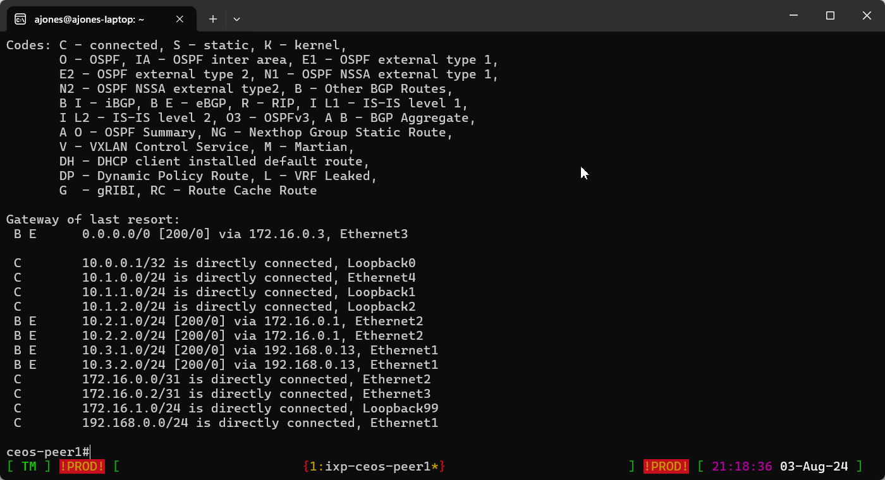

# tmux-for-neteng
Example tmux configuration designed for Network Engineers

- [Why use TMUX?](#why-use-tmux)
- [Try it out](#try-it-out)
- [Installation](#installation)
- [Usage](#usage)

Special shoutout to https://leanpub.com/the-tao-of-tmux/read which was a major help in building this configuration. A great resource if you want to learn everything there is to know about tmux and want to build your own configuration.

## Why use TMUX?

- You may not have access to the SSH application of choice at your job
- Great for using on Linux jumphosts, or networks where you cannot SSH using your work/personal device 
- Allows you to create and navigate between SSH sessions without having to move your hand to the mouse constantly
- Switching between host tabs quickly allows you to quickly compare device config/output
- If you get disconnected from your jumphost, your existing sessions aren't lost when you reconnect
- VIM commands in your scrollback buffer allows you to search for specific configuration/logs/etc.
- Customizable bottom bar lets you highlight if you are working in production or your lab(s)

## Try it out

The below button will spin up a basic ubuntu codespaces image with tmux installed with this config if you want to give it a spin. The few aliases defined (i.e. test-router1) won't actually work due to no SSH but you will see the window name change and a log file created.

## Installation

Pretty much every modern linux distribution these days has tmux installed by default. If not simply install tmux using your distributions package manager.

To use this tmux configuration, simply copy and paste the contents of the [.tmux.conf](.tmux.conf) file into your home directories `~/.tmux.conf`

I've included an example addition to your .bashrc ([example-bashrc.txt](example-bashrc.txt)) which you can simply paste at the bottom of your `~/.bashrc` file and edit as necessary.

I've also included an example CSV file ([hosts.csv](hosts.csv)) and accompanying basic python ([generate-bashrc.py](generate-bashrc.py)) script to generate the .bashrc additions that you can use for your environment(s).

Remember to create the log directory in your home directory if you want automatic logging on your SSH sessions (`mkdir log`). Aliases are there so you can tab complete hosts with ease.

## Usage

TMUX should automatically start when you SSH into your host, but if not you can simply execute `source .bashrc`.

Keybindings I've used as a personal preference, you can change this if you want in your own .tmux.conf file to suit your own preferences. Mousewheel scrolling and clicking of the tabs also should work.

| Keybind | Description |
| ------------------------- | --- |
| `Ctrl+Space + c` | Create new window |
| `Ctrl+Space + Ctrl+Space` | Switch between current and last window (can hold down Ctrl) |
| `Ctrl+Space + 1-9` | Switch to window # |
| `Ctrl+Space + [` | Switch to scrollback mode, can use VIM bindings here to search, etc. Press Enter twice to exit |
| `Ctrl+Space + -` | Create a Horizontal Split |
| `Ctrl+Space + =` | Create a Vertial Split |
| `Alt+Arrow Keys` | Navigate between Split Panes |
| `Ctrl+Space + d` | Detach TMUX |
| `Ctrl+Space + r` | Reload TMUX config |